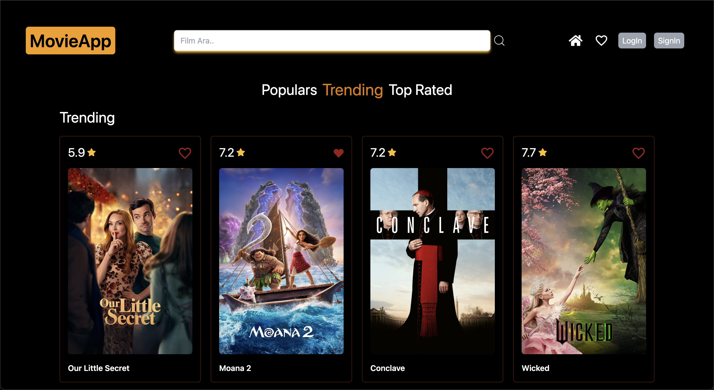
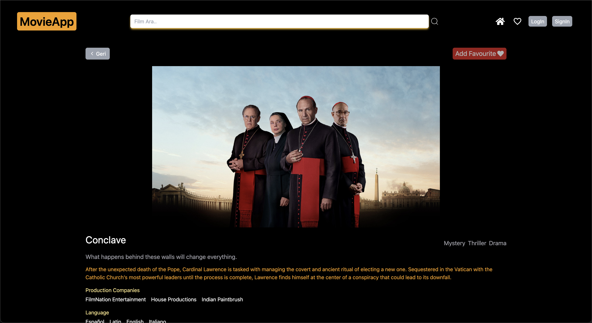
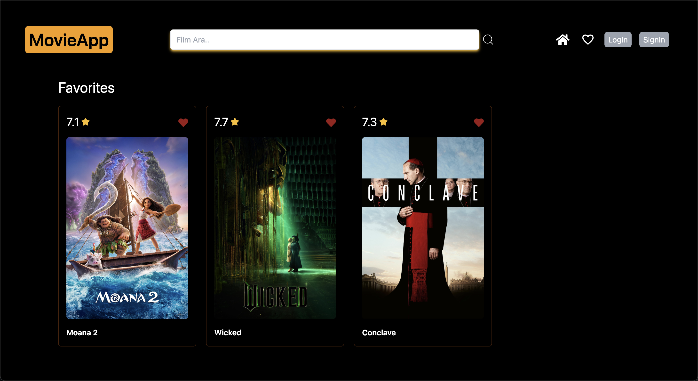

# Movie App 🎬

Movie App is a modern, user-friendly application that allows users to explore popular movies, view detailed information, and manage their favorite movies. It uses the The Movie Database (TMDb) API to fetch movie data and offers a sleek design powered by TailwindCSS.

## Screenshots 🖼️

### video gif


### Homepage

(Displays movies categorized as Top Rated, Trending, and Popular)


### Movie Details Page

(View detailed information about the selected movie)


### Favorites Page

(View and manage your favorite movies)



## Features 🌟

- Movie Categories:
  On the homepage, movies are listed under three categories:

- - 🏆 Top Rated
- - 🔥 Trending
- - 🌟 Popular
- Pages:

- - Homepage: Browse movies by category.
- - Movie Details: Get detailed information about a selected movie.
- - Favorites: View and manage your list of favorite movies.
- Add/Remove Favorites: Easily add or remove movies from your favorites list.

- User-Friendly Interface: Navigate seamlessly through the app.

- Modern Design: Styled with TailwindCSS for a clean and responsive look.

## Technologies Used 🛠️

- Language: TypeScript
- Framework: React
- Project Setup: Vite
- State Management: Redux Toolkit Query
- API: TMDb API
- Styling: TailwindCSS
- Icons: React Icons

### Installation

1. Clone the repository:

   ```
   git clone https://github.com/ozerbaykal/Movie-App.git

   cd Movie-App

   cd MovieApp

   ```

2. Install dependencies:

```
 npm install

```

```
npm run dev
```

3.  Open the application in your browser:

```
http://localhost:3000

```

## Contributing

Contributions are welcome! Please open an issue first to discuss what you would like to change.

- 1.Fork the project
- 2.Create your feature branch (git checkout -b feature/NewFeature)
- 3.Commit your changes (git commit -m 'Add new feature')
- 4.Push to the branch (git push origin feature/NewFeature)
- 5.Open a Pull Request

<h2>Contact</h2>

Özer BAYKAL mail : baykalozer87@gmail.com

Project Link:https://github.com/ozerbaykal/Movie-App
