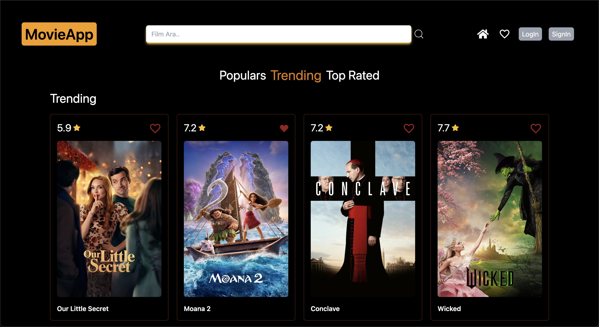
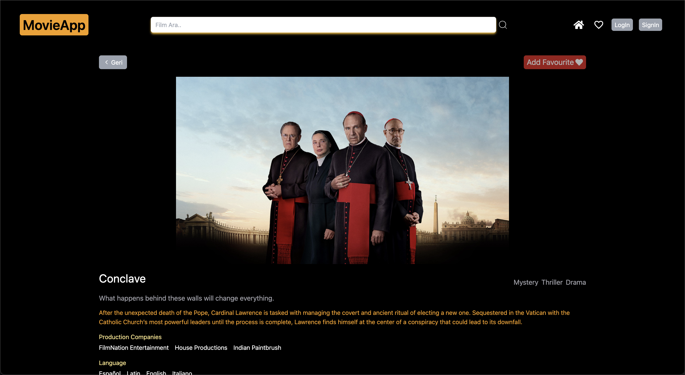
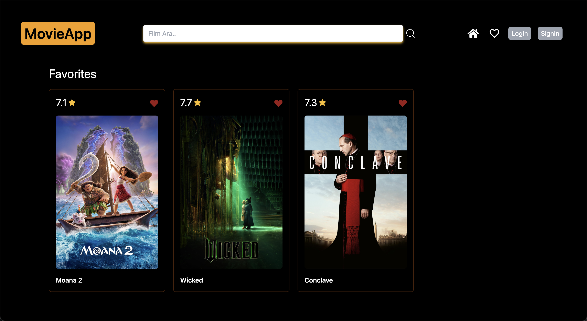

# Movie App 🎬

Movie App is a modern, user-friendly application that allows users to explore popular movies, view detailed information, and manage their favorite movies. It uses The Movie Database (TMDb) API to fetch movie data and offers a sleek design powered by TailwindCSS.

## Screenshots 🖼️

### Video GIF


### Homepage


_(Main page displaying movie categories)_

### Movie Details Page

(View detailed information about the selected movie)

_(Shows detailed movie information such as plot, release date, and more.)_

### Favorites Page

(View and manage your favorite movies)

_(Manage your favorite movies and easily add or remove them.)_

## Features 🌟

- **Movie Categories**:
  On the homepage, movies are listed under three categories:

  - 🏆 Top Rated
  - 🔥 Trending
  - 🌟 Popular

- **Pages**:
  - **Homepage**: Browse movies by category.
  - **Movie Details**: View detailed information about a selected movie.
  - **Favorites**: View and manage your list of favorite movies.
- **Add/Remove Favorites**: Easily add or remove movies from your favorites list.

- **User-Friendly Interface**: Navigate seamlessly through the app.

- **Modern Design**: Styled with TailwindCSS for a clean and responsive look.

## Technologies Used 🛠️

- **Language**: TypeScript
- **Framework**: React
- **Project Setup**: Vite
- **State Management**: Redux Toolkit Query
- **API**: TMDb API
- **Styling**: TailwindCSS
- **Icons**: React Icons

## Installation

1. Clone the repository:
   ```
   git clone https://github.com/ozerbaykal/Movie-App.git
   cd Movie-App
   ```
2. Install dependencies:

```
npm install

```

3. Create a .env file:
   You will need to create a .env file in the root directory of the project to securely store your API key and base URLs.

Example .env file:

```
VITE_BASE_URL="https://api.themoviedb.org/3"
VITE_AUTHORIZATION_KEY="Bearer YOUR_API_KEY"
VITE_BASE_IMG_URL="https://image.tmdb.org/t/p/original"

```

- Replace YOUR_API_KEY with your actual TMDb API key. If you don't have an API key, you can get one by registering at [The Movie Database (TMDb)](https://www.themoviedb.org/)

4. Run the development server:

```
npm run dev

```

## Contributing

Contributions are welcome! Please open an issue first to discuss what you would like to change.

- 1.Fork the project
- 2.Create your feature branch (git checkout -b feature/NewFeature)
- 3.Commit your changes (git commit -m 'Add new feature')
- 4.Push to the branch (git push origin feature/NewFeature)
- 5.Open a Pull Request

## Contact 📬

**Özer BAYKAL**  
Email: [baykalozer87@gmail.com](mailto:baykalozer87@gmail.com)  
Project Link: [Movie App on GitHub](https://github.com/ozerbaykal/Movie-App)
